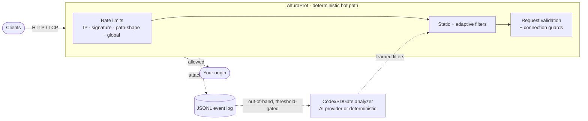

<p align="center">
  <a href="https://github.com/CuriosityOS/AlturaProt">
    <picture>
      <source media="(prefers-color-scheme: dark)" srcset=".github/assets/altura-logo-dark.svg">
      
    </picture>
  </a>
</p>

<h1 align="center">AlturaProt</h1>

<p align="center">
  A Layer&nbsp;7 DDoS-protection reverse proxy in Rust.<br>
  Deterministic mitigation in the hot path — AI as an optional, out-of-band precision layer.
</p>

<p align="center">
  <a href="https://github.com/CuriosityOS/AlturaProt/actions/workflows/ci.yml"></a>
  <a href="LICENSE"></a>
  
  
  <a href="CONTRIBUTING.md"></a>
</p>

<p align="center">
  <a href="#install">Install</a> ·
  <a href="#how-it-works">How it works</a> ·
  <a href="#cli">CLI</a> ·
  <a href="docs/ARCHITECTURE.md">Architecture</a> ·
  <a href="docs/AI_PROVIDERS.md">AI providers</a> ·
  <a href="docs/OPERATIONS.md">Operations</a>
</p>

---

> [!NOTE]
> **Defensive software.** AlturaProt protects services you operate. The bundled
> flood/benchmark tool is loopback-only by default and refuses public targets.

AlturaProt is a Rust reverse proxy for HTTP/1 and raw TCP that keeps every
availability decision **deterministic and in-process** — token-bucket rate
limits, static and adaptive filters, and strict request validation all run on the
hot path with no dependency on an external service. An optional out-of-band
analyzer (**CodexSDGate**) turns attack telemetry into narrow, validated filter
rules, calling an AI provider only when a real attack is underway and a
deterministic generator otherwise.

## Highlights

- **Deterministic hot path** — per-IP, per-signature, per-path-shape route-family, trusted-proxy aggregate, and global token buckets; bounded limiter state that high-cardinality rotation can't reset; `429` shedding before filter scans.
- **Strict request hygiene** — HTTP method + Host allowlists, spoof-sanitized `X-Forwarded-For`, header/body/trailer byte+field+count+time caps, slowloris and slow read/upload guards, and chunked / `Expect` / `Range` / `Accept-Encoding` policies.
- **Adaptive learned filters** — signature and path-shape rules that stay dormant, activate during matching floods via rolling token buckets, reclaim idle windows under pressure, and reject easy-to-fat-finger root-wide `/` blocks.
- **AI is a precision layer, not a dependency** — the proxy never calls AI on the request path. CodexSDGate learns filters offline and only invokes a provider once an attack crosses a tunable threshold (default `20` real attack events); below that it uses a free deterministic generator. [Details »](docs/AI_PROVIDERS.md)
- **Raw TCP proxy** — per-client-prefix and global connection-rate and concurrency caps, connect/idle timeouts, optional per-direction min-data-rate guard, and max connection duration.
- **Operational guardrails** — a config preflight that fails startup on unsafe values, `RLIMIT_NOFILE` capacity checks, bounded JSONL event logging with rotation, token-protected Prometheus metrics, and host-edge nftables/sysctl/systemd templates.

<details>
<summary><b>The full, exhaustive control list</b></summary>

- HTTP/1 reverse proxy with per-client prefix, per-signature, per-path-shape route-family, trusted-proxy aggregate, and global token-bucket limits.
- Bounded rate-limiter state that evicts stale buckets but denies new active keys when a shard is full, so high-cardinality rotation cannot reset existing hot IP, signature, or path-shape buckets.
- HTTP method allowlist, Host header validation, bounded trusted `X-Forwarded-For` parsing, forwarded-header/client-IP spoof sanitization, normalized request-signature and path-shape rate caps that collapse long dynamic tokens plus high-confidence short tokens without merging version segments such as `/api/v1` and `/api/v2`, bounded sibling-churn limiting for short lowercase token rotation under one parent route, trusted-proxy aggregate rate and in-flight caps, downstream keep-alive disabled by default, downstream write timeout for slow readers, raw initial HTTP/1 header/framing validation with incremental delimiter scanning plus hard byte, per-field, and count caps, request framing validation, request content-encoding policy, default chunked request-body rejection with opt-in, default `Expect` rejection with opt-in `100-continue`, bounded `Range` request policy, default origin `Accept-Encoding` stripping with opt-in passthrough, connection-open rate caps, active connection caps, sharded `SO_REUSEPORT` accept sockets, in-flight upstream request caps, upstream connect timeout, path-shape-scoped passive upstream failure circuit breaker, per-connection request caps, request and upstream response header byte/field/count caps, framing validation, and timeouts, default-stripped HTTP trailers with opt-in capped forwarding, request/upstream body recent-window minimum data-rate guards, request body guardrails, and upstream response body guardrails.
- Rate-limited admin health checks and token-protected Prometheus metrics.
- Raw TCP proxy with per-client-prefix and global connection-rate limits, global/per-client-prefix concurrent-connection caps, sharded `SO_REUSEPORT` accept sockets, outbound connect timeout, idle timeout, optional per-direction minimum data-rate guard, and max connection duration.
- Runtime `RLIMIT_NOFILE` preflight and capacity validation so configured connection caps are backed by an explicit file-descriptor floor.
- Config preflight that rejects oversized/non-regular/malformed config inputs and out-of-range DDoS-critical knobs (rate caps, resource ceilings, header/body/trailer/metadata caps, timeouts, connection lifetimes, event-log and adaptive-window and filter-TTL bounds, circuit settings, method/Host allowlists, trusted-proxy and admin control-plane settings) so unsafe values fail startup instead of silently disabling protection; `0` remains the explicit per-rate-bucket disable value.
- SIGINT/SIGTERM shutdown handling so service-manager stops enter the same listener-drain path as Ctrl-C.
- Static JSON filters for known bad HTTP patterns, plus bounded and validated static/runtime filter rules with response-header-safe rule IDs, compiled header/user-agent match data, and snapshot-based rule evaluation on the request path.
- Adaptive learned filters that stay dormant, activate during matching floods through rolling token-bucket counters, reclaim idle signature/path-shape windows under capacity pressure, preserve recent evidence, and stop admitting fresh detector keys when a shard is full of recent windows.
- JSONL attack event logs for offline/nearline analysis, with bounded user-controlled fields, a bounded nonblocking queue capped at `8192` owned events, worker-side JSON serialization, bounded flush cadence, and byte/backup-count-capped rotation.
- Optional CodexSDGate analyzer that converts attack logs into constrained adaptive filter rules using either a subscription agent CLI you already logged into (Codex, Claude, OpenCode, Cursor, Grok — wrapped the way T3 Code does) or an API key (OpenAI, Anthropic, Gemini, OpenRouter).
- Host-edge nftables/sysctl/systemd templates plus a validation preflight for L3/L4 and service-manager backstops, including explicit size bounds on dynamic nftables SYN-rate and connection-limit sets and exemptions for essential ICMPv4/ICMPv6 control traffic.
- Local-only benchmark/flood script that refuses non-loopback targets by default.

</details>

## How it works



Availability is protected by deterministic controls first: token buckets, static
filters, and learned adaptive signatures/path shapes — all running in the proxy,
able to drop matching traffic immediately. CodexSDGate is the precision layer: it
learns narrow filters from telemetry so repeat attacks are blocked quickly with
fewer false positives. For volumetric floods that saturate the link before the
proxy can inspect traffic, pair it with upstream/provider blackholing, scrubbing,
CDN/anycast, or router ACLs — AlturaProt ships host-edge templates for smaller
L3/L4 floods, but provider-side mitigation is still required when the pipe itself
is full.

## Install

One command installs everything — it downloads a prebuilt binary for your
platform (or builds from source when none is published / run from a checkout),
writes config, and (system mode) creates the service user and systemd unit. On a
terminal it also offers an optional **AI Power Detection** step to wire an AI
provider for adaptive filtering.

```bash
# system install, then enable + start the service
curl -fsSL https://raw.githubusercontent.com/CuriosityOS/AlturaProt/main/install.sh | sudo bash -s -- --start

# user install (no root)
curl -fsSL https://raw.githubusercontent.com/CuriosityOS/AlturaProt/main/install.sh | bash -s -- --user
```

<details>
<summary><b>Install with an agent (fully non-interactive)</b></summary>

Every prompt has a flag, so an AI agent or CI job can install and wire AI in one
command. `--ai auto` picks whatever you already have — the first installed agent
CLI (Codex, Claude, OpenCode, Cursor, Grok), else the first provider whose
API-key env var is set:

```bash
# "Install AlturaProt and use whatever AI I'm already set up with"
curl -fsSL https://raw.githubusercontent.com/CuriosityOS/AlturaProt/main/install.sh \
  | bash -s -- --user --ai auto --non-interactive

# Pick a provider explicitly; key read from the standard env var
GEMINI_API_KEY=sk-... curl -fsSL .../install.sh \
  | bash -s -- --user --ai gemini --non-interactive
```

`--non-interactive` is also implied automatically when there is no terminal, so
one-liners never hang. There is **no capability difference** between a
subscription CLI and an API key — both feed the same analyzer.

</details>

Or from a checkout:

```bash
git clone https://github.com/CuriosityOS/AlturaProt
cd AlturaProt
sudo ./install.sh --start    # system mode: /usr/local/bin, /etc/altura-prot, systemd unit
./install.sh --user          # user mode:   ~/.local/bin, ~/.config/altura-prot
```

System mode creates the `altura-prot` service user/group and writes config to
`/etc/altura-prot`. No `admin_token` is set by default, so the token-protected
metrics endpoint stays closed until you set one:

```bash
sudo altura-prot config set http.upstream http://127.0.0.1:9000
sudo altura-prot config set http.admin_token <secret>
sudo systemctl restart altura-prot
```

## CLI

The `altura-prot` binary is also a management CLI:

```bash
altura-prot init                                   # create config dir + default config (--system for /etc)
altura-prot validate                               # validate the active config file
altura-prot config show                            # print the resolved config as JSON
altura-prot config get http.limits.per_ip_rps      # read one value by dot path
altura-prot config set http.admin_token <secret>   # set one value (validated before write)
altura-prot run                                     # start the proxy
altura-prot status                                  # systemd or process status
```

`config set` is atomic: it writes a temp file, validates it, and only renames it
into place on success, so a rejected value never replaces a working config. The
active config resolves from `--config`, then `$ALTURA_PROT_CONFIG`,
`/etc/altura-prot/config.json`, `~/.config/altura-prot/config.json`, and finally
`configs/example.json`.

## Quick start (from source)

```bash
cargo test
cargo run --release -- --config configs/example.json
```

In another terminal, run an origin and send traffic through the proxy:

```bash
python3 -m http.server 9000 --bind 127.0.0.1
curl http://127.0.0.1:8080/
python3 tools/run_local_bench.py --duration 10 --workers 64
```

## AI-powered adaptive filters

CodexSDGate reads the proxy's attack-event log and writes `runtime/filters.json`.
It only calls an AI provider once a batch holds at least `--min-attack-events`
**real attack** events (default `20`) — so tokens are spent during real attacks,
not on noise — and falls back to a deterministic generator otherwise.

```bash
python3 tools/ai_provider_cli.py login claude        # or codex / opencode / cursor / grok / an API key
python3 tools/codexsdgate.py --provider claude \
  --events runtime/attack_events.jsonl --filters runtime/filters.json --once
```

See **[docs/AI_PROVIDERS.md](docs/AI_PROVIDERS.md)** for the subscription-CLI
family, the OpenAI/Anthropic/Gemini/OpenRouter API setups, the trigger threshold,
and the optional systemd timer.

## Documentation

| Doc | What's inside |
| --- | --- |
| [Architecture](docs/ARCHITECTURE.md) | Hot-path design, limiters, filters, event pipeline |
| [Operations](docs/OPERATIONS.md) | Install, CLI, AI step, systemd timer, hardening |
| [AI providers](docs/AI_PROVIDERS.md) | Provider families, cost-control threshold, runtime contract |
| [Benchmarks](docs/BENCHMARKS.md) | Local load + edge-template smoke results |
| [Edge protection](docs/EDGE_PROTECTION.md) | Host-edge nftables/sysctl/systemd templates |

## Contributing

Contributions are welcome! See **[CONTRIBUTING.md](CONTRIBUTING.md)** for setup
and the checks CI runs (`cargo fmt`, `clippy`, `cargo test`, and the Python
tooling tests). Please keep flood/benchmark changes loopback-only.

## Security

This is defensive software for protecting services you operate. Report
vulnerabilities privately per **[SECURITY.md](SECURITY.md)** — not as public
issues. The bundled flood tool refuses public targets by design.

## License

Released under the [MIT License](LICENSE).

<p align="center"><sub>Built with Rust · defensive security tooling · deterministic by design</sub></p>
